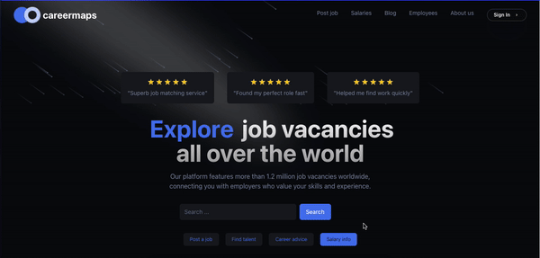

# careermaps

This is a web application built with Next.js, TypeScript, Shadcn, and Aceternity.

## Features

- **Next.js** for server-side rendering and static site generation.
- **TypeScript** for type safety and better developer experience.
- **Shadcn** for modern and responsive UI components.
- **Aceternity** Beautiful Tailwind CSS and Framer Motion Components, .

## Credit

Figma UI/UX design

[DS CODE on Youtube](https://www.youtube.com/watch?v=qARIYfmxnCE&t=349s)

## Screenshots

